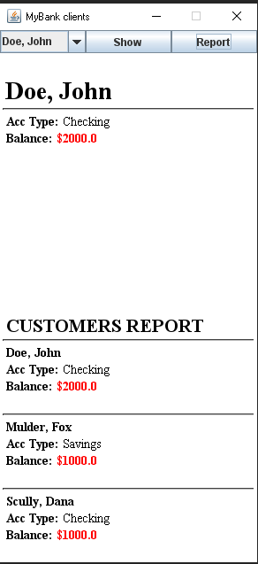

# UI Lab 3

В ході першої роботи вам пропонується виконати **наступне завдання** - [Робота 3: GUI з Swing](https://github.com/ppc-ntu-khpi/GUI-Lab1-Starter/blob/master/Lab%203%20-%20SWING/Lab%203.md)

## На "п'ять"
1. Додайте ще одну кнопку - *Report*, яка має виводити у нижній частині вікна звіт за клієнтами такого ж виду, як у роботі номер 8 (див. CustomerReport). 
2. Запустіть проект, впевніться, що все працює як очікувалось. Продемонстрируйте результат викладачеві.

